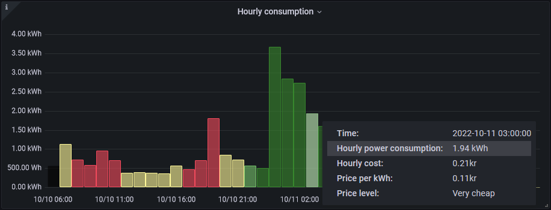

# PSTibber

PowerShell module for accessing the Tibber GraphQL API: <https://developer.tibber.com/docs/overview>

[](https://www.powershellgallery.com/packages/PSTibber) [](https://www.powershellgallery.com/packages/PSTibber)

> _:heavy_check_mark: See [CHANGELOG.md](CHANGELOG.md) for what's new!_



> _:heavy_check_mark: See [here](https://github.com/stefanes/tibber-pulse) for an example of this module in action..._

## Installation

Using the [latest version of PowerShellGet](https://www.powershellgallery.com/packages/PowerShellGet):

```powershell
Install-Module -Name PSTibber -Repository PSGallery -Scope CurrentUser -Force -PassThru
Import-Module -Name PSTibber -Force -PassThru
```

Or if you already have the module installed, update to the latest version:

```powershell
Update-Module -Name PSTibber
Import-Module -Name PSTibber -Force -PassThru
```

## Authentication

> **Note**
>
> To access the API you first must have a Tibber account (you can sign up for Tibber using [this link]() to get a 50€/kr bonus for use in the [Tibber Store](https://tibber.com/se/store)).

A _Personal Access Token_ can be generated here: <https://developer.tibber.com/settings/access-token>

To authenticate, pass the generated access token using the [`-PersonalAccessToken`](docs/functions/Invoke-TibberQuery.md#-personalaccesstoken) parameter with each call or set the `TIBBER_ACCESS_TOKEN` environment variable:

```powershell
$env:TIBBER_ACCESS_TOKEN = "<your access token>"
```

## User agent

> **Note**
> 
> Please set a user agent so Tibber can better track different client implementations.

To set a user agent, pass the string using the [`-UserAgent`](docs/functions/Invoke-TibberQuery.md#-useragent) parameter with each call or set the `TIBBER_USER_AGENT` environment variable:

```powershell
$env:TIBBER_USER_AGENT = 'stefanes.tibber-pulse/0.1.0'
```

## Usage

> _:heavy_check_mark: See [here](docs/graphql-ws.md) for how to use this module with your Tibber Pulse/Watty._

Use `Get-Command -Module PSTibber` for a list of functions provided by this module. See the help associated with each function using the `Get-Help` command, e.g. `Get-Help Get-TibberUser -Detailed`, and the documentation available [in `docs`](docs/functions/) for more details:

- [`Connect-TibberWebSocket`](docs/functions/Connect-TibberWebSocket.md)
- [`Disconnect-TibberWebSocket`](docs/functions/Disconnect-TibberWebSocket.md)
- [`Get-TibberConsumption`](docs/functions/Get-TibberConsumption.md)
- [`Get-TibberHome`](docs/functions/Get-TibberHome.md)
- [`Get-TibberPriceInfo`](docs/functions/Get-TibberPriceInfo.md)
- [`Get-TibberProduction`](docs/functions/Get-TibberProduction.md)
- [`Get-TibberUser`](docs/functions/Get-TibberUser.md)
- [`Invoke-TibberQuery`](docs/functions/Invoke-TibberQuery.md)
- [`Read-TibberWebSocket`](docs/functions/Read-TibberWebSocket.md)
- [`Register-TibberLiveMeasurementSubscription`](docs/functions/Register-TibberLiveMeasurementSubscription.md)
- [`Unregister-TibberLiveMeasurementSubscription`](docs/functions/Unregister-TibberLiveMeasurementSubscription.md)

If there is no function available for what you are trying to do, you can always use the [`Invoke-TibberQuery`](docs/functions/Invoke-TibberQuery.md) function with a valid GraphQL query:

```powershell
$query = @"
{
  viewer {
    homes {
      id
      consumption(resolution: HOURLY, last: 1) {
        nodes {
          to
          consumption
          cost
        }
      }
      currentSubscription {
        priceInfo {
          tomorrow {
            startsAt
            total
            level
          }
        }
      }
    }
  }
}
"@
$response = Invoke-TibberQuery -Query $query
$response.viewer.homes[0]
```

_Note: You can construct your GraphQL queries using the [Tibber API explorer](https://developer.tibber.com/explorer)._

### Examples

#### Get logged-in user detail

```powershell
$response = Get-TibberUser -Fields 'login', 'userId', 'name'
Write-Host "$($response.name) <$($response.login)> with user Id $($response.userId)"
```

#### Get home Id

```powershell
$response = Get-TibberHome -Fields 'id', 'appNickname' -IncludeFeatures
($response | Where-Object { $_.appNickname -eq 'Vitahuset' }).id | Tee-Object -Variable homeId
```

#### Check if your home has a _Tibber Pulse_ or _Watty_ registered

```powershell
$response = Get-TibberHome -Fields 'appNickname' -IncludeFeatures -Id $homeId
Write-Host "Your home, $($response.appNickname), has real-time consumption $(
    if ([bool]::Parse($response.features.realTimeConsumptionEnabled)) {
        'enabled!'
    }
    else {
        'disabled...'
    }
    )"
```

#### Get the size of your main fuse

```powershell
(Get-TibberHome -Fields 'mainFuseSize' -Id $homeId).mainFuseSize
```

#### Get time of maximum energy price

```powershell
$response = Get-TibberPriceInfo -Last 10
$maxPrice = $response | Sort-Object -Property total -Descending | Select-Object -First 1
Write-Host "Max energy price, $($maxPrice.total) $($maxPrice.currency), starting at $(([DateTime]$maxPrice.startsAt).ToString('yyyy-MM-dd HH:mm')) [$($maxPrice.level)]"
```

#### Get today's and tomorrow's energy prices

```powershell
$response = Get-TibberPriceInfo -IncludeToday -IncludeTomorrow
Write-Host "Today's and tomorrow's energy prices: $($response | Out-String)"
```

#### Get time of maximum power consumption

```powershell
$response = Get-TibberConsumption -Last 10
$maxCons = $response | Sort-Object -Property consumption -Descending | Select-Object -First 1
Write-Host "Max power consumption $($maxCons.cost) $($maxCons.currency) ($($maxCons.consumption) $($maxCons.consumptionUnit) at $($maxCons.unitPrice)): $(([DateTime]$maxCons.from).ToString('HH:mm')) - $(([DateTime]$maxCons.to).ToString('HH:mm on yyyy-MM-dd'))"
```

#### Get time of maximum power production

```powershell
$response = Get-TibberProduction -Last 10
$maxProd = $response | Sort-Object -Property production -Descending | Select-Object -First 1
Write-Host "Max power production $($maxProd.profit) $($maxProd.currency) ($($maxProd.production) $($maxProd.productionUnit) at $($maxProd.unitPrice)): $(([DateTime]$maxProd.from).ToString('HH:mm')) - $(([DateTime]$maxProd.to).ToString('HH:mm on yyyy-MM-dd'))"
```

#### Send push notifications

```powershell
$response = Send-PushNotification -Title 'Hello' -Message 'World!' -ScreenToOpen CONSUMPTION
Write-Host "Sent push notification to $($response.pushedToNumberOfDevices) device(s)"
```

### The response cache

The response from all `Get` functions are cached by default, this means that the next time you call the same function with the same parameters the result stored in the cache will be returned with **no new request sent to the GraphQL endpoint**. Use `-Force` to force a refresh of any cached results:

```powershell
PS> Get-TibberUser -Verbose
VERBOSE: Invoking web request: POST https://api.tibber.com/v1-beta/gql [User agent = PSTibber/0.6.1 stefanes.tibber-pulse/0.1.0]
VERBOSE: POST with 68-byte payload
VERBOSE: received 178-byte response of content type application/json

User Id                              User
-------                              ----
dcc2355e-6f55-45c2-beb9-274241fe450c Arya Stark <arya@winterfell.com>

PS> Get-TibberUser -Verbose
VERBOSE: From cache: b0c06ad71d17d320d1bbada3a930f6e6174e222b

User Id                              User
-------                              ----
dcc2355e-6f55-45c2-beb9-274241fe450c Arya Stark <arya@winterfell.com>

PS> Get-TibberUser -Force -Verbose
VERBOSE: Invoking web request: POST https://api.tibber.com/v1-beta/gql [User agent = PSTibber/0.6.1 stefanes.tibber-pulse/0.1.0]
VERBOSE: POST with 68-byte payload
VERBOSE: received 178-byte response of content type application/json

User Id                              User
-------                              ----
dcc2355e-6f55-45c2-beb9-274241fe450c Arya Stark <arya@winterfell.com>
```

_Note: The entire cache can be cleared by re-importing the module, `Import-Module -Name PSTibber -Force -PassThru`._

### Debugging

To view the GraphQL query sent in the requests, add the `-Debug` switch to the command. To also include the response, add the `-DebugResponse` switch.

Example:

```powershell
PS> Get-TibberUser -Debug -DebugResponse
DEBUG: GraphQL query: { "query": "{ viewer{ login,userId,name,accountType,websocketSubscriptionUrl,__typename }}" }
DEBUG: Response: 200 OK
DEBUG: Response content: {"data":{"viewer":{"login":"arya@winterfell.com","userId":"dcc2355e-6f55-45c2-beb9-274241fe450c","name":"Arya Stark","accountType":["tibber","customer"],"websocketSubscriptionUrl":"wss://websocket-api.tibber.com/v1-beta/gql/subscriptions","__typename":"Viewer"}}}

DEBUG: Cache entry [b0c06ad71d17d320d1bbada3a930f6e6174e222b]: @{viewer=}

User Id                              User
-------                              ----
dcc2355e-6f55-45c2-beb9-274241fe450c Arya Stark <arya@winterfell.com>
```

## Tibber Pulse/Watty (live measurement data)

The live measurement data, generated by e.g. _[Tibber Pulse](https://tibber.com/se/store/produkt/pulse)_ or _[Watty](https://tibber.com/se/store/produkt/watty-tibber)_, is served as a GraphQL subscription. See [here](docs/graphql-ws.md) for details.
