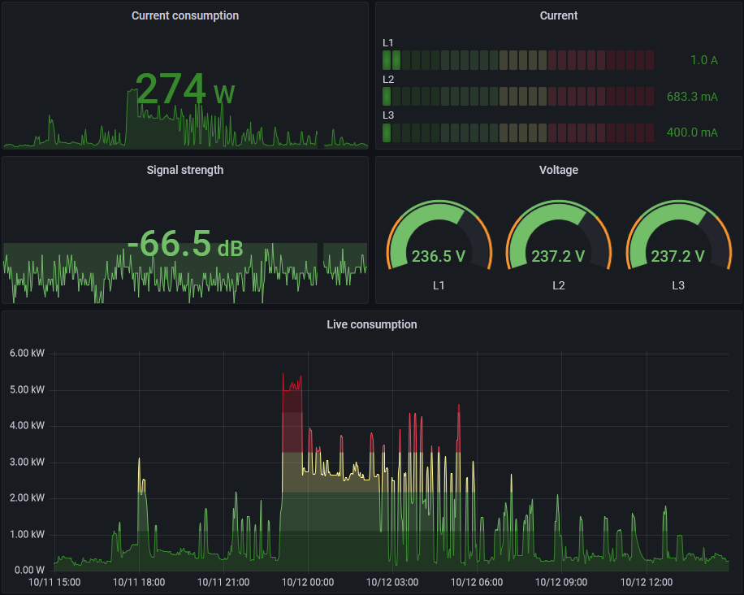

# GraphQL over WebSocket

The live measurement data, generated by e.g. _[Tibber Pulse](https://tibber.com/se/store/produkt/pulse-p1)_ or _[Watty](https://tibber.com/se/store/produkt/watty-tibber)_, is served as a GraphQL subscription. This protocol is defined here: [GraphQL over WebSocket Protocol](https://github.com/enisdenjo/graphql-ws/blob/master/PROTOCOL.md)



## Usage

Since GraphQL subscriptions are handled as streams over a persistent connection (WebSocket), the process for accessing this data is a bit different compared to REST APIs:

1. Connect to the GraphQL subscription endpoint and initialize connection
2. Subscribe to data streamed from the GraphQL subscription endpoint
3. Read data from stream
4. Unsubscribe from data stream and close connection

### Connect to endpont and initialize

**Step 1** is handled by the function [`Connect-TibberWebSocket`](functions/Connect-TibberWebSocket.md):

```powershell
$connection = Connect-TibberWebSocket
Write-Host "New connection created: $($connection.WebSocket.State)"
```

### Subscribe to data stream

To subscribe to the live measurement data stream (**step 2**) call the function [`Register-TibberLiveMeasurementSubscription`](functions/Register-TibberLiveMeasurementSubscription.md), passing the connection object returned from the previous call:

```powershell
$subscription = Register-TibberLiveMeasurementSubscription -Connection $connection -HomeId '96a14971-525a-4420-aae9-e5aedaa129ff'
Write-Host "New GraphQL subscription created: $($subscription.Id)"
```

### Read data stream

Packages are read from the stream (**step 3**) by calling the function [`Read-TibberWebSocket`](functions/Read-TibberWebSocket.md) and providing a callback script block/function.

With inline script block:

```powershell
Read-TibberWebSocket -Connection $connection -Callback { param($package)
    Write-Host "New package on WebSocket connection: $package"
}
```

With pre-defined function:

```powershell
function Write-PackageToHost {
    param (
        [string] $package
    )
    Write-Host "New package on WebSocket connection: $package"
}

Read-TibberWebSocket -Connection $connection -Callback ${function:Write-PackageToHost}
```

Use [`-CallbackArgumentList`](functions/Read-TibberWebSocket.md#-callbackargumentlist) to pass additional arguments to the callback script block/function, positioned **after** the response:

```powershell
function Write-PackageToHost {
    param (
        [Object] $Json,
        [string] $With,
        [string] $Additional,
        [int] $Arguments
    )
    Write-Host "New Json document received: $($Json.payload.data | Out-String)"
    Write-Host "$With $Additional $Arguments"
}

Read-TibberWebSocket -Connection $connection -Callback ${function:Write-PackageToHost} -CallbackArgumentList @("Hello", "world!", 2022)
```

#### Duration, deadline, or max package count

To limit the time we read from the WebSocket, provide the [`-DurationInSeconds`](functions/Read-TibberWebSocket.md#-durationinseconds), [`-ReadUntil`](functions/Read-TibberWebSocket.md#-readuntil) and/or the [`-PackageCount`](functions/Read-TibberWebSocket.md#-packagecount) parameters:

```powershell
$result = Read-TibberWebSocket -Connection $connection -Callback ${function:Write-PackageToHost} -DurationInSeconds 30
Write-Host "Read $($result.NumberOfPackages) package(s) in $($result.ElapsedTimeInSeconds) seconds"

$result = Read-TibberWebSocket -Connection $connection -Callback ${function:Write-PackageToHost} -ReadUntil ([DateTime]::Now).AddSeconds(20)
Write-Host "Read $($result.NumberOfPackages) package(s) in $($result.ElapsedTimeInSeconds) seconds"

$result = Read-TibberWebSocket -Connection $connection -Callback ${function:Write-PackageToHost} -PackageCount 3
Write-Host "Read $($result.NumberOfPackages) package(s) in $($result.ElapsedTimeInSeconds) seconds"
```

_Note: If more than one of `-DurationInSeconds`, `-ReadUntil`, or `-PackageCount` are provided the function will return as soon as the first of these limits are hit._

### Unsubscribe and close connection

**Step 4** is done by unsubscribing from the data stream using [`Unregister-TibberLiveMeasurementSubscription`](functions/Unregister-TibberLiveMeasurementSubscription.md) and closing the WebSocket connection using [`Disconnect-TibberWebSocket`](functions/Disconnect-TibberWebSocket.md):

```powershell
Unregister-TibberLiveMeasurementSubscription -Connection $connection -Subscription $subscription
Write-Host "New GraphQL subscription with Id $($subscription.Id) stopped"

Disconnect-TibberWebSocket -Connection $connection
```

### Example

Complete example of reading live measurement data for 30 seconds and gracefully closing the connection when done:

```powershell
function Write-PackageToHost {
    param (
        [Object] $Json
    )
    Write-Host "New Json document received: $($Json.payload.data | Out-String)"
}

# Get the home Id
$response = Get-TibberHome -Fields 'id', 'appNickname'
$homeId = ($response | Where-Object { $_.appNickname -eq 'Vitahuset' }).id

# Connect WebSocket and register a subscription
$connection = Connect-TibberWebSocket
$subscription = Register-TibberLiveMeasurementSubscription -Connection $connection -HomeId $homeId

# Read data stream
$result = Read-TibberWebSocket -Connection $connection -Callback ${function:Write-PackageToHost} -DurationInSeconds 30
Write-Host "Read $($result.NumberOfPackages) package(s) in $($result.ElapsedTimeInSeconds) seconds"

# Unregister subscription and close down the WebSocket connection
Unregister-TibberLiveMeasurementSubscription -Connection $connection -Subscription $subscription
Disconnect-TibberWebSocket -Connection $connection
```

### Timeouts for WebSocket operations

All above functions have a parameter named `-TimeoutInSeconds`, representing the time to wait for WebSocket operations, or -1 to wait indefinitely. Use this parameter to adjust the timeouts depending on your network environment.
